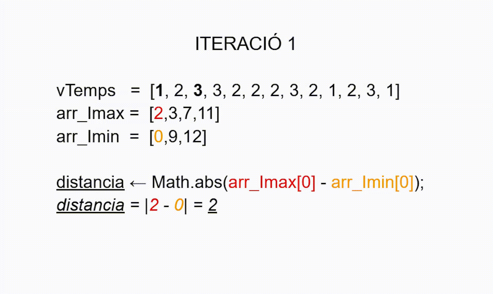

# 0. Index

1. [Introducció](#1-introducció)
2. [Escalfament pre-nadalenc (preparació 2024)](#2-escalfament-pre-nadalenc-preparació-2024)
   - [Problema A (Elegint la seu del mundial)](#problema-a-elegint-la-seu-del-mundial)
   - [Problema B (Places disponibles per al mundial)](#problema-b-places-disponibles-per-al-mundial)
   - [Problema C (Verificació de les entrades)](#problema-c-verificació-de-les-entrades)
   - [Problema D (Events dels partits)](#problema-d-events-dels-partits)
   - [Problema E (Fase de grups)](#problema-e-fase-de-grups)
   - [Problema F (Fase final)](#problema-f-fase-final)

3. [2023 (Regional Villaviciosa de Odón i Terrassa)](#2023-regional-villaviciosa-de-odón-i-terrassa)
   - [Problema "Metidos en un cajón"](#problema-metidos-en-un-cajón-molt-fàcil) 
   - [Problema "dia mundial piano" (anys de traspàs)](#problema-dia-mundial-piano-anys-de-traspàs-fàcil) 
   - [Problema "Verdugo" (l'ahorcado)](#problema-verdugo-lahorcado-intermig) 

4. [2023 (Regional de Zaragoza)](#2023-regional-de-zaragoza)
   - [Problema "Espiral Galáctica" (intermig)](#problema-espiral-galáctica-intermig)
   - [Problema "Acrónimos" (fàcil-intermig)](#problema-acrónimos-fàcil-intermig) 
   - [Problema "Curiosa Propiedad 9 (fàcil)"](#problema-curiosa-propiedad-9-fàcil)


# 1. Introducció

En aquest repositori es resoldran problemes de la competició ProgramaMe. Tots els problemes pujats estan validats amb AC (_accepted_ o acceptat) fent servir el validador de la pàgina web https://aceptaelreto.com/ que implementa solucions als mateixos i compara els outputs amb la sortida dels programes que he fet i he publicat aquí, a menys que s'indiqui el contrari en el comentari del problema (si en algun cas no és acceptat diré quin error s'ha produït i per què no s'ha pogut fer funcionar). Cada problema té al titol un link a la pàgina mencionada, que conté el compilador per fer la validació del codi del qui l'intenti i una còpia de l'enunciat.

# 2. Escalfament pre-nadalenc (preparació 2024)

Els problemes d'aquesta secció es poden trobar, a més a més de tenir-los en format html fent click al titol de la secció que encapçala cada cada problema, en format PDF a la [pàgina de la programaMe](https://programame.com/documents/ProblemsSets/2024/ProgramaMe-2024-Navidad.pdf) o en aquest[arxiu pujat al repositori](/Escalfament%20PreNadalenc%202024/ProgramaMe-2024-Navidad.pdf).

## [Problema A (Elegint la seu del mundial)](https://aceptaelreto.com/problem/statement.php?id=709)

Penso que la millor forma de resoldre aquest problema és mitjançant una estructura de dades que permeti emmagatzemar parelles de clau : valor de forma eficient, acumulant així per a cada cas de prova el nombre d'ocurrències -vots- que cada país té (és una parella clau -país- i valor -nombre d'ocurrències-). En Python l'estructura de dades que permet implementar aquesta solució són els diccionaris (`dict`), i en C++ i Java tenim els HashMap (d'estructura molt més complicada que els diccionaris de Python).

En Java, podem declarar un map d'aquesta manera:

`Map<String, int> elMeuMap = new HashMap<String, int>();`

Per iterar a través d'un map podem fer servir la sintaxis for-each de la que ens proveeix Java i, un cop tenim cada parell <strong>clau:valor</strong> podem accedir al seu contingut mitjançant les funcions `getKey()` i `getValue()`. Cal fer notar que és necessari declarar cada <strong>parell_clauValor</strong> com un `Map.Entry<String, Integer>` i que quan iterem `elMeuMap` no podem iterarlo de manera com fèiem amb els tipus de dades primitius, sinó que ens cal cridar una funció en l'objecte que conté el nostre map `elMeuMap.entrySet()`, que retorna un `Set` o conjunt d'objectes `Map.Entry` (objectes clau:valor). 

Així doncs, la sintaxis per iterar un map quedaria de la següent manera:

```
for (Map.Entry<String, Integer> parell_clauValor : elMeuMap.entrySet()) {                             
       String clau = parell_clauValor.getKey(); 
       int valor = parell_clauValor.getValue();
} 
```

Cal també esmentar com crear un nou parell clau:valor dins d'un map, per una banda; i com accedir a un valor a partir d'una clau dins el map, per l'altra. Per aconseguir la creació d'un nou parell farem servir la funció put(): així doncs `elMeuMap.put(clau, valor)` afegirà un parell clau:valor al diccionari. D'altra banda, per accedir al valor que tingui el map per clau `clau` farem `elMeuMap.get(clau)`.

Finalment cal esmentar que en aquest problema és necessari l'ús de la funció `sc.next()` que permet consumir del canal estàndard d'entrada la següent paraula d'una linia d'strings (nextline en canvi consumiria tota una línia i no ens permetria resoldre bé el problema). 
El problema l'he resolt així:

https://github.com/blackcub3s/ProgramaMe/blob/35584fcbe66f34466e57c62ed98f0995b5fc5ba6/Escalfament%20PreNadalenc%202024/ProblemaA.java#L3-L73


## [Problema B (Places disponibles per al mundial)](https://aceptaelreto.com/problem/statement.php?id=710)


El problema B implica primer absorbir el primer enter de la seqüència d'entrada (que indica el nombre de casos de prova del mundial que inclou el test). Un cop fet això ja es pot anar a processar cada cas de prova (cada línia). En cada cas de prova es demana senzillament fer una diferència entre la suma dels equips assignats a les sis confederacions del mundial i el nombre d'equips E que participen en el mundial i imprimir-la per pantalla. La meva solució en java (no mostro l'import de l'Scanner, veure arxiu sencer):

https://github.com/blackcub3s/ProgramaMe/blob/d41cbd36ec54a9ed44250de4baa1bf9b5fc7b004/Escalfament%20PreNadalenc%202024/ProblemaB.java#L9-L34

La meva solució en C++, que no requereix netejar el búfer després de llegir tipus de dades primitius i requereix menys codi per fer-lo funcionar [^1]. 

https://github.com/blackcub3s/ProgramaMe/blob/aad3b0229793ab84210b2d8c770ae1f6af06df22/Escalfament%20PreNadalenc%202024/ProblemaB.cc#L1-L29


## [Problema C (Verificació de les entrades)](https://aceptaelreto.com/problem/statement.php?id=711)

Aquest problema no és tant complicat com el problema A. Tot i així, sí que té una petita complicació: cal saber carregar cada un dels casos de prova (nombres) com a strings i accedir a cada un dels digits d'aquests nombres individualment. Per fer aquest accés cal saber passar de char a enter. Hi ha dues formes de fer-ho: una, seria amb la funció `int n = Character.getNumericValue(nre.charAt(i));`; l'altra seria fer servir una funció comuna que permet convertir un string a enter, i per a fer-ho ens caldrà passar el char a String amb un truquet (concatenar un char amb un String buit ens permet obtenir un string!) i aleshores podrem utilitzar funcions ben conegudes que converteixin d'String a enter sense saber-nos les funcions que converteixen de Char a enter, així: `int n = Integer.parseInt(""+nre.charAt(i));`.

Aquest exercici també té la dificultat de recórrer les cadenes a l'esquerra i a la dreta del nombre en qüestió (cosa que he disseccionat en sengles funcions fora del main) i de vigilar què és posició parell d'un digit dins el nombre del cas de prova (index senar, si indexem des de zero) o posició senar d'un digit dins el nombre del cas de prova (index parell, si indexem des de zero):

https://github.com/blackcub3s/ProgramaMe/blob/8c9db2b48edfde816eb743478d3d55c0973071d7/Escalfament%20PreNadalenc%202024/ProblemaC.java#L7-L53

## [Problema D (Events dels partits)](https://aceptaelreto.com/problem/statement.php?id=712)

Aquest problema no el va enviar ningú quan es va fer el repte de l'escalfament pre-nadalenc (un repte amb més de 900 persones i amb poc temps per resoldre tots els problemes). Era, doncs, un problema visiblement complicat. La solució que proposo aquí funciona per al cas de prova proporcionat a l'enunciat de la web d'aceptaelreto, però es prega al lector prendre la solució amb cautela ja que el programa aquí mostrat dóna error de límit de temps excedit en enviar-lo al servidor de comprovació (<strong>TLE -_Time limit exceeded_-</strong>). Entenc que el problema no es produeix perquè la solució programada estigui innerentment mal programada, sino perquè la funció `sc.hasNextInt()` no funciona com seria d'esperar. No he aconseguit que aturi la sequència d'entrada de valors `N`, que és incerta ja que depèn del nombre de casos de prova i no ens els informen ni ens donen una senyal d'aturada de la seqüència d'entrada: això fa que el programa es quedi esperant un altre nombre i no s'aturari fins que no entri un caràcter NO numèric (cosa que mai tindrem als casos de prova). Si es pogués corregir aquest aspecte segurament funcionaria.

En la solució que jo proposo s'aconsegueix tenir en compte els casos de prova amb casos particulars com  `N==1` (un sol esdeveniment per partit, que a la pràctica és estrany, però es podria donar en els tests que facin per comprovar el nostre programa) i `N > 1` (més d'un esdeveniment per partit). També tinc en compte quan només es fa una consulta per a un esdeveniment del partit (`q == 1`), cridant exclusivament a la funció `fesSortidaPerConsulta_igual_a_1()`; també considero els casos en que `q > 1` tot fent ús de la funció `fesSortidaPerConsulta_amb_q_superior_a_1()`. Es aquesta última funció la que té un comportament un tant complicat: fer una finestra de q espais que es vagi desplaçant d'esquerra a dreta al llarg del vector `v` mirant el temps que passa entre l'esdeveniment inicial de la finestra i el següent, entre el següent i el tercer, i així successivament fins arribar al que ocupa la posició `q` (v el fem servir per guardar els diferents moments temporals on es van produint els events durant el partit). Després, aquesta finestra la mourem a la dreta una unitat i repetirem el procés anterior. D'aquest procés iteratiu, de cada finestra, ens guardem en una variable `tqMin` el temps mínim que passa fins a recorrer els `q` esdeveniments i la posició inicial `iMaxDens` per trobar un cop acabem de recórrer tot `v`amb la finestra l'esdeveniment inicial que dóna peu a la regió amb `q` esdeveniments amb _màxima densitat_. 


https://github.com/blackcub3s/ProgramaMe/blob/6475385f22f524f7732a35f38497e55ad9e6cf41/Escalfament%20PreNadalenc%202024/ProblemaD%20(corregir%20error%20massa%20temps%20execucio).java#L9-L100


## [Problema E (Fase de grups)](https://aceptaelreto.com/problem/statement.php?id=713)

Per fer aquest problema començem processant els casos de prova encapçalats per les variables enteres `N Q` en la mateixa línia (que són el nombre d'equips de la fase de grups i la quantitat d'equips classificats, respectivament). En l'inici del plantejament ens podem preguntar com volem parar la lectura del canal estàndard d'entrada quan ja no hi hagi entrades d'enters `N Q` (haguem consumit tots els casos de prova). No aconsegueixo que el `do...while` s'aturi quan ja no hi ha cap altre enter pel canal estàndard d'entrada, ja que `sc.hasNextInt()` no retorna `false` fins que no rep _algo_ que no sigui un enter, cosa que no passa en l'enunciat del problema perquè deixen el nombre de casos de prova obert i no informen de final de seqüència. <strong>Com aconseguir, amb java, que el bucle de lectura de casos de prova acabi? És exactament la mateixa dificultat que tinc a l'exercici D</strong>.

De cara a processar cada cas de prova, després d'engollir `N i Q` ens diuen que tenim $N(N-1)/2$ enfrentaments entre partits. Com a curiositat (podeu passar al següent paràgraf, no és necessari saber-ho per fer el problema), aquesta fórmula la podem obtenir de representar tots els $N$ equips en una matriu d'adjacència on tindriem  $N^2$ cel·les, éssent cada cel·la un enfrentament entre cada equip. Si mirem el nombre de cel·les de la matriu, li treiem aleshores els $N$ elements de la diagonal principal -enfrentament d'un equip amb ell mateix, que no és possible- i després eliminem la meitat dels elements restants de la matriu, és a dir el triangle inferior o superior -ja que no hi ha partits de tornada, i ens quedem amb el triangle restant és quan tenim el nombre d'enfrentaments igual a $N(N-1)/2$:


$$\text{Nombre Enfrentaments} =  (N^2 - N)/2 = N(N-1)/2$$

La part del problema més interessant era ordenar la matriu de resultats primer per la columna dels punts (segona columna) i, sense que es perdés aquesta ordenació, ordenar després er la columna de la diferència de gols (cinquena columna) i, finalment, per la columna dels gols a favor (tercera columna). Per fer això es pot aconseguir amb el que anomenen `Comparator`. No domino la sintaxis i no tinc encara la capacitat tècnica suficient per fer-los servir així que aquesta secció l'he demanat a xatGPT (al programa està indicada la secció que ha fet la IA). Justament és aquesta secció la que genera, pressumptament, <strong>un error de compilació (CE)</strong> així que la resolució del problema cal interpetar-la amb cautela:

```

ProblemaE.java:96: error: ')' expected
                    .comparingInt((int[] row) -> row[1]) // Sort by the SECOND column
                                        ^
ProblemaE.java:96: error: illegal start of expression
                    .comparingInt((int[] row) -> row[1]) // Sort by the SECOND column
                                               ^
ProblemaE.java:96: error: ';' expected
                    .comparingInt((int[] row) -> row[1]) // Sort by the SECOND column
                                                       ^
ProblemaE.java:97: error: illegal start of expression
                    .thenComparingInt(row -> row[4])     // Then sort by the FIFTH column
                                           ^
ProblemaE.java:98: error: illegal start of expression
                    .thenComparingInt(row -> row[2])     // Finally, sort by the THIRD column
                                           ^
5 errors
```

El programa és el següent:

https://github.com/blackcub3s/ProgramaMe/blob/e9036f9061d1e67f4f7b5201eea77524a9b5f5e6/Escalfament%20PreNadalenc%202024/ProblemaE%20(error%20CE).java#L17-L22

## [Problema F (Fase final)](https://aceptaelreto.com/problem/statement.php?id=714)

Cada cas de prova del problema F l'he resolt dins la funció `tractaCasDeProva()` creant un vector per als noms dels equips `noms` i un altre vector per als gols que marquen els equips `gols`, cada un d'ells amb `N` posicions (valor que indica el nombre d'equips que tenim inicialment). Res més començar el processament del cas de prova s'emplenen ambdós vectors amb els `N` equips (amb `N` compresa entre 2 i 64, sempre sent potencia de dos). 

Després tenim un while amb condició de finalització `(N != 1)`. A la primera iteració del mateix simplement recorrem tot el vector de `gols` (amb `N` gols) i mirem els guanyadors dels enfrentaments. Els `N/2` valors dels equips guanyadors els reubiquem a la primera meitat de `noms` i amb la segona meitat del vector ja no hi treballarem.

A la segona iteració enfrentem entre sí els `N/2` equips que han guanyat en la fase anterior, guardats com hem dit en la primera meitat del vector `noms` a la iteració anterior, i entrem pel canal estàndard d'entrada els `gols` de la següent fase, emmagatzemant-los en la primera meitat del vector `gols` (de nou, ara treballarem només amb la primera meitat -`N/2` valors- del vector `gols`). 

A la tercera iteració o fase mirarem només la primera quarta part del vector `noms`, ja que tindrem `N/4` equips i podrem ara llegir pel canal estàndard d'entrada els gols d'aquesta següent fase, emmagatzemant-los en la quarta primera porció del vector `gols`... i així successivament fins a trobar-nos que només ens quedin dos equips i l'equip guanyador ens quedi al primer element del vector `noms`. El bucle pararà quan s'hagi assolit que `N/N == 1`.

A sota la solució:

https://github.com/blackcub3s/ProgramaMe/blob/7c1952672df73f0f251b18c5edfae3fa38b6afa0/Escalfament%20PreNadalenc%202024/ProblemaF.java#L9-L61


# 2023 (Regional Villaviciosa de Odón i Terrassa)

Aqui hi ha resolució de problemes de regional de villaviciosa d'odón i terrassa 2023, realitzats en la universitat europea i en l'institut nicolau copèrnic.

## [Problema "Metidos en un cajón"](https://aceptaelreto.com/problem/statement.php?id=682&cat=156) (molt fàcil)

Dificultat extremadament fàcil. Si es programa de zero es pot tenir el programa llest i entregat en menys de quatre minuts. Nom

La solució en java:

https://github.com/blackcub3s/ProgramaMe/blob/25d2fae7c750acce8de3930ebb9dc60ad55c94b9/villaviciosaTerrassa2023/picosPatas.java#L1-L18

La solució en C++:

https://github.com/blackcub3s/ProgramaMe/blob/25d2fae7c750acce8de3930ebb9dc60ad55c94b9/villaviciosaTerrassa2023/picosPatas.cc#L1-L14


## [Problema "dia mundial piano" (anys de traspàs)](https://aceptaelreto.com/problem/statement.php?id=676&cat=156) (fàcil)

El problema d'anys de traspàs és típic i no és llarg de fer, però no és trivial de codificar si no es presta atenció als condicionals. L'enunciat no deixava les normes de l'any de traspàs molt molt clares, pel meu gust; així doncs es pot consultar [aquest recurs electrònic](https://learn.microsoft.com/es-es/office/troubleshoot/excel/determine-a-leap-year) i després programar-ho a partir de les següents normes:


>Para determinar si un año es bisiesto, siga estos pasos:
>
>- Si el año es uniformemente divisible por 4, vaya al paso 2. De lo contrario, vaya al paso 5.
>- Si el año es uniformemente divisible por 100, vaya al paso 3. De lo contrario, vaya al paso 4.
>- Si el año es uniformemente divisible por 400, vaya al paso 4. De lo contrario, vaya al paso 5.
>- El año es un año bisiesto (tiene 366 días).
>- El año no es un año bisiesto (tiene 365 días).

La solució:

https://github.com/blackcub3s/ProgramaMe/blob/9224ba2612898647e7f3ab2410e7046ee4e1a7e7/villaviciosaTerrassa2023/bisiesto.java#L1-L38


## [Problema "Verdugo" (l'ahorcado)](https://aceptaelreto.com/problem/statement.php?id=678&cat=156) (intermig)

Per resoldre aquest problema he fet servir dos conjunts. No ho diu al problema però se sobreentèn que cal tenir en compte que si un jugador tracta d'endivinar una lletra, i aquesta es repeteix múltiples vegades en la paraula oculta, automàticament haurà adivinat totes les ocurrències de la lletra en la paraula oculta.

Per resoldre'l he fet servir dos instàncies d'una estructura de dades amb les que Java implementa la idea matemàtica de conjunt. Això és important de considerar-ho perquè si no hagués estat així, resoldre el problema amb conjunts seria impossible ja que un conjunt té una i només una ocurrència, no té elements repetits).

Un conjunt e n java s'implementa mitjançant el tipus de dades Set i Hashset en java (cal fer dos imports amb el NetBeans):

S'anomena HashSet i podem implementar-lo d'aquesta forma:

```
EN GENERAL:
Set<TipusDada> conjuntet = new HashSet<>();

CASOS CONCRETS:
Set<Integer> conjuntEnterets = new HashSet<>();
Set<Character> conjuntCharete = new HashSet<>();
HashSet<String> conjuntStringete = new HashSet<>();

```
Noteu que fem servir "Integer" en comptes de "int", o "Character" en comptes de "char". Això és perquè demana introduir un tipus de dades "reference type". Els tipus "int" o "char" son tipus primitius i no referencien a res. En canvi, "Integer" o "Character" si que són "Reference types": defineixen classes que "embolcallen" sengles tipus primitius. És important saber-ho perquè si fas ```Set<int> conjuntEnters = new HashSet<>();``` o ```Set<char> conjuntCaracters = new HashSet<>();``` és incorrecte: et donarà error.

El temps dedicat que he invertit en resoldre el problema del verdugo ha estat d'una hora. Després ha calgut debugejar una mica el main per la lectura de la marca final (uns 10 minuts més), perquè calia prémer intro dues vegades per acabar l'execució del programa (donava RTE abans dels canvis i AC després). A continuació la versió que passa el test:


https://github.com/blackcub3s/ProgramaMe/blob/caa4297df9f934b73be60bacb211fdc099535a75/villaviciosaTerrassa2023/Verdugo.java#L4-L73

## [Problema "Termoclastismo"](https://aceptaelreto.com/problem/statement.php?id=683&cat=156) (difícil)

Per a qualsevol cas de prova donat, veiem que el problema de termoclastismo és senzill de fer per trobar les temperatures màximes i mínimes; però no ho és tant per trobar la diferència mínima entre les posicions que ocupen en la seqüència d'entrada d'una temperatura màxima i una temperatura mínima (és a dir, el que ens defineixen com la **distància mínima** entre ambdues). La resolució aquí mostrada dóna **AC** però per a arribar-hi ha calgut passar per diverses Wrong Answers. 

https://github.com/blackcub3s/ProgramaMe/blob/41ddef4c41f5df0fd36fabe0393a6d400faed479/villaviciosaTerrassa2023/Termoclastismo.java#L3-L102

A continuació explicaré l'estratègia seguida i l'algoritme emprat:

Per trobar `tMax`i `tMin` només cal recórrer la seqüència de temperatures i anar actualitzant sengles variables que haviem creat abans de llegir les dades del cas: així, a cada iteració del recorregut dels valors de la seqüència, si trobem un valor `t` tal que `t < tMin` actualitzarem `tMin`; mentre que si compleix `t > tMax` aleshores ctualitzerm `tMax`. Res complicat. Ara bé, el problema de trobar la distància mínima en la seqüència entre la temperatura màxima i mínima no és pas trivial quan tenim temperatures màximes i mínimes repetides. Això, per tant, ens obliga a guardar en un array `vTemps` totes les temperatures mentre en llegiem la seqüència per trobar `iMax`i `iMin`.

Primer de tot si es dóna que en acabar el recorregut de la seqüència de les temperatures d'entrada es dóna que `tMax`i `tMin` són iguals, aleshores ja sabem que les temperatures trobades en el cas de prova son _totes_ iguals i, per tant, ja haurem trobat que la `distancia` serà zero i la podrem imprimir per pantalla (no éssent necessari recórrer el `vTemps`). Anàlogament, si `tMax`i `tMin` no estessin repetits en la seqüència no ens caldria guardar les temperatures en el vector `vTemps`. Malauradament no és així i el cas més complex és la norma i no l'excpeció: aquest es dóna quan tinguem temperatures màximes i mínimes repetides pero que ni `tMax` ni `tMin`siguin el mateix valor (és a dir, no totes les temperatures de la seqüència siguin iguals), cas en que la única forma que se m'acudeix de resoldre el problema és tornar a recórrer les temperatures, ara ja guardades dins de `vTemps`, i preguntar quins índexos ocupen els valors de `tMax` i els valors de `tMin`. Un cop tinguem la informació, els índexos de les temperatures màximes els guardarem dins de `arr_Imax`i els índexos de les temperatures mínimes els guardarem dins de `arr_Imin`. Per tant, si tenim un cas de prova amb la següent seqüència de temperatures amb 13 valors (`1 2 3 3 2 2 2 3 2 1 2 3 1 `) podriem rerpresentar els valors de `vTemps`, `arr_Imax` i `arr_Imin` com si fos Python o pseudocodi de la següent forma:


```
NOTA: damunt de vTemps escric els indexos del 0 al 9 per legibilitat del vector.

          0|1|2|3|4|5|6|7|8|9| ...
vTemps = [1 2 3 3 2 2 2 3 2 1 2 3 1] 
arr_Imax = [2,3,7,11]
arr_Imin = [0,9,12]

```

Fixeu-vos que els índexos de les posicions que ocupen les temperatures màximes i mínimes dins d'aquestes llistes estan ordenats dins de cada llista. És fàcil veure a simple vista que la distància mínima la trobarem si comparem la temperatura 3 (temperatura màxima dins vTemps) de la posició 11 i la temperatura 1 (temperatura mínima dins vTemps) de la posició 12. Però per a què ho faci el programa haurem de mirar `arr_Imax` i `arr_Imin`:  Així doncs per trobar la distància mínima d'índexos de temperatures màximes i mínimes no és necessari que mirem totes les combinacions possibles de les dues arr (molt ineficient) sino comparar element a element i d'esquerra a dreta les dues llistes.

Primer comparem arr_Imax[0] amb arr_Imin[0] (fent abs(arr_Imin[0] - arr_Imax[0])). Si la diferència trobada en valor absolut és 1 aleshores ja hem trobat la distància mínima que buscavem, i no cal seguir mirant les arrays. En cas contrari, caldrà seguir comparant les dues arrays `arr_Imax` i `arr_Imin` fins a arribar a una diferència en valor absolut de 1 o bé fins arribar fins al final de les llistes.

Per procedir a cada iteració del bucle incrementarem en 1 l'índex de `arr_Imax` o `arr_Imin` segons quin dels dos últims valors d'índex de temperatura que hem comparat entre cada array sigui el més petit. Així doncs, a cada ocasió estarem reduint potencialment la diferència. 

Per exemple, a la primera iteració comparem `arr_Imax[0]` que és 2 amb `arr_Imin[0]` que és 0 (abs(2-0) --> 2 i per tant no hem acabat). Per tant, a la segona iteració, aumentarem en una unitat l'índex de `arr_Imin` (que té el valor més petit dels dos que hem comparat). Així doncs a la tercera iteració compararem  `arr_Imax[0]` que és 2 amb `arr_Imin[1]` que és 9. A la quarta iteració aumentarem l'índex que es mou per la llista `arr_Imax` (que ara te el valor més petit en la comparació anterior) i per tant compararem `arr_Imax[1]` que és 3 amb  `arr_Imin[1]` que és 9... I aixi fins arribar a trobar la diferència mínima que en aquest cas de prova es trobarà just abans del final de les llistes, quan fem la comparació `arr_Imax[3]` que és 11 i `arr_Imin[2]` que és 12.

Aquest algoritme per cercar la distància mínima queda exemplificat en aquest gif per al cas particular que esmentavem (compte, l'algoritme en el gif no recull un error que havia comès inicial: que cal fer ```distancia = Math.min(distancia, Math.abs(arr_Imax[i] - arr_Imin[j]));``` en comptes de ```distancia = Math.abs(arr_Imax[i] - arr_Imin[j])```):



I el fragment de codi:

https://github.com/blackcub3s/ProgramaMe/blob/41ddef4c41f5df0fd36fabe0393a6d400faed479/villaviciosaTerrassa2023/Termoclastismo.java#L77-L90


# 2023 (Regional de Zaragoza)

Aquí poso les meves solucions a problemes de la competició regional de saragossa al centre San Valero, l'any 2023:

## [Problema "Espiral Galáctica" (Intermig)](https://aceptaelreto.com/problem/statement.php?id=697&cat=157)

Existeixen quatre casos a tenir en compte en aquest problema per quan recorrem els elements de la espiral: quan ens movem cap amunt (disminuim index de fila una unitat), cap a la dreta (aumentem índex de columna una unitat), cap abaix (aumentem index de fila una unitat) i cap a l'esquerra (disminuim index de columna una unitat). Per a cada un dels casos cal prestar atenció a les condicions de finalització dels bucles. 

Per a fer-lo i que sigui acceptat amb veredicte AC a acepta el reto he tardat una hora. Cal vigilar on incrementem variables com "nreEstrellesEnLinia" i ser curós: ja que fem servir quatre índexos per resoldre'l. És fàcil confondre's i incrementar dins un for un index que no és:

https://github.com/blackcub3s/ProgramaMe/blob/b4e071c3233fb9c11823b9af148b9c778e9bafef/Zaragoza2023/EspiralGalactica.java#L4-L87


## [Problema "Acrónimos" (fàcil-intermig)](https://aceptaelreto.com/problem/statement.php?id=694&cat=157)

Per resoldre aquest problema i obtenir AC he tardat 30 minuts (no s'han necessitat diversos enviaments). Calia fer ús del mètode ```sc.nextLine()``` per obtenir cada linia (cas de prova) i funcions com ```linia.Split(" ")``` per tallar el contingut de cada linia en paraules. Un cop fet això podiem trobar si una paraula començava per majusucula o no amb ```Character.isUpperCase``` (fent servir el mètode dels strings ```charAt()``` passant el valor 0 com a paràmetre per obtenir la primera lletra de cada paraula):


https://github.com/blackcub3s/ProgramaMe/blob/8d14cd26d8a625cff3f9786a0b78131faae27252/Zaragoza2023/Acronimos.java#L4-L36


## [Problema "Curiosa Propiedad 9" (fàcil)](https://aceptaelreto.com/problem/statement.php?id=695&cat=157)

Per resoldre aquest problema he tardat 23 minuts. He optat per passar cada cas de prova (un enter) a un string. Aquest string l'he passat a un vector d'enters ``vN_petit``, l'he ordenat amb el mètode sort per generar el valor més petit. Després he fet servir aquest vector ordenat per generar el valor més gran (en un altre vector d'enters ``vN_gran`` simplement invertint l'ordenació del vector anterior). Aquests vectors d'enters els he fet servir per crear sengles strings que tenen els valors dels enters passats a string i concatenats. Després he passat de nou a enter, prèviament eliminant el padding de zeros a l'inici de l'string dels valors petits amb ```petit = petit.replaceFirst("0+", "");```. En aquesta funció el primer paràmetre es una expressió regular ("0+" significa esborrar totes les ocurrencies de zero -+ significa totes-) però com que fem servir la funció  ```replaceFirst``` en comptes de ```replaceAll```, el que farà serà eliminar només les ocurrències de zeros a l'esquerra dels petits (no a tot l'string). 

https://github.com/blackcub3s/ProgramaMe/blob/fa4b0fc7bdeb88766656361667b9ddc89a41fa74/Zaragoza2023/CuriosaPropiedad9.java#L3-L50


# 2024 (Regional de València) 

Aquests problemes pertanyen a la programaMe regional de València organitzada per IES Serra Perenxisa (Torrent, València). En aquesta vam aconseguir enviar correctament els problemes A, B i D (equip de 2).

## Problema A: Secuencia digna

TO DO

## Problema B: Binario equilibrado (facil)

Aquest és el problema tal qual es va enviar a la competició, amb veredicte AC. Per resoldre'l cal verificar que:
1. El primer digit de cada cas de prova sigui igual al penúltim dígit del mateix i que el segon digit de cada cas de prova sigui igual a l'últim del mateix. Si no es dóna això, ja podem imprimir "ERROR" i anar a processar el següent cas de prova.
2. Si es dóna l'anterior premisa, aleshores hem de mirar que el nombre de uns i de zeros de la següència o cas de prova sigui el mateix i imprimir que la sequència és "EQUILIBRADA".

Cada cas de prova ocupa una línia i es llegeix pel CEE amb ```sc.nextLine()```, accendint després a cada caràcter (cada 1 o cada 0) amb la funció dels strings ```charAt()```. Aquest és el codi del problema:

https://github.com/blackcub3s/ProgramaMe/blob/9dea857ca428e9f55cb80b514796a2f141ee5940/IES%20Serra%20Perenxisa%20(Torrent%202024)/ProblemaB.java#L3-L55

## Problema C: Trampeando el feedback (intermig)

Aquest problema el vaig intentar a la competició programaMe però no em va donar temps d'acabar-lo. Aquesta versió, modificada a posteriori, passa els casos de prova especificats a sota però **NO ha passat ENCARA el jutge online** (queda per verificar-lo un cop pengin les solucions al jutge online, així que prego al lector llegir el codi amb cautela).

La lectura de l'entrada té un nombre T que informa del nombre de casos de prova. Després trobem, per a cada cas de prova, dues línies que el composen. A continuació mostrem l'exemple d'input públic que van mostrar durant la competició: 

``` 
3
4 10 5 5 10
1 1 1 1
4 10 5 5 10
1 2 3 1
7 0 5 0 2
3 1 1 2 3 3 3

```

Els _outputs_ que el programa ha de generar pels tres casos de prova anteriors són:

```
19
18
5
```

En la primera línia d'un cas de prova qualsevol trobem els nombres (per ordre) N, A, B, X i Y. Éssent N el nombre d'usuaris, A el nombre de likes que té el servidor A inicialment, B el nombre de dislikes que té el servidor A inicialment, X el nombre de likes que té el servidor B inicialment i, finalment, Y el nombre de dislikes que té el servidor B inicialment.

El problema en essència ens diu que, a partir d'aquestes dades, tenim dos servidors on es poden fer votacions de like i dislike, cada un amb un contador independent de likes i dislikes. Després, també ens diu que tenim tres tipus d'usuaris: el **tipus 1**, que dóna sempre like en una votació; El **tipus 2**, que dóna sempre dislike en una votació; i el **tipus 3**, que és un usuari _influenciable_ pel feedback que rep del servidor on l'enviem a votar: dóna dislike sempre que vegi que en el servidor hi hagi registrats més dislikes que likes o, en cas contrari (si veu que hi ha més likes que dislikes o el mateix nombre de likes que de dislikes) aleshores dóna un like. 

Finalment, en el problema se'ns demana que maximitzem la suma dels likes dels dos servidors. Aquesta maximització l'haurem de fer manipulant a quin servidor voldrem enviar cada usuari, perquè voti segons ens convingui a nosaltres. Considerant que cada usuari vota una i només una vegada en un sol servidor, i que no pot escollir no votar, i deixant de banda l'ètica implicada en aquest enunciat, aquí està el codi que resol el problema tal i com jo l'he entès (a sota del codi explico l'estratègia per solucionar el problema i així entendre'l millor):

https://github.com/blackcub3s/ProgramaMe/blob/95cdec8c4c52070c0b7a8059041f6d28197c8cee/IES%20Serra%20Perenxisa%20(Torrent%202024)/ProblemaC.java#L3-L78


L'estratègia que he emprat per solucionar el problema, a grans trets, és la següent:

1. Els usuaris tipus 1 està clar que caldrà enviar-los al servidor que tingui més likes en relació al nombre de likes (al "millor" servidor). 
2. Als usuaris de tipus 2 caldrà enviar-los al servidor que tingui un nombre menor de likes en relació al nombre de dislikes (és a a dir al "pitjor" servidor). 
3. Els usuaris de tipus 3 ja són més complexos. En essència només els enviarem al "millor" servidor si en podem aconseguir incrementar els likes i, si veiem que no aconseguim que l'usuari n'aumenti els likes, per evitar que ens posi un dislike al millor servidor, l'enviarem a votar al "pitjor" perquè el compteig negatiu no afecti al "millor":

Per trobar quin és el millor servidor tenim les variables `dA` i `dB`, que les calculem fent i les descrivim en els comentaris:

https://github.com/blackcub3s/ProgramaMe/blob/95cdec8c4c52070c0b7a8059041f6d28197c8cee/IES%20Serra%20Perenxisa%20(Torrent%202024)/ProblemaC.java#L26-L27

Per exemple, anem a posar un cas particular: si fem una comparació com la seqüent `dA > dB` i aquesta és certa, això significa que el servidor A té mes likes en relació a dislikes que el servidor B (és el B el que, en aquest cas particular, anomeno "millor" servidor). En aquest cas també evitarem tot allò que ens pugui penalitzar amb un vot negatiu en el "millor" servidor, és a dir, que un usuari de tipus 3 voti en A si el servidor A té més dislikes que likes o que un usuari de tipus 2 voti en el servidor A; pel contrari, sota aquest supòsit, farem tot allò que ens doni un vot al "millor" servidor: és a dir, que l'usuari de tipus 3 voti en A si el servidor A té més likes que dislikes (o igual nombre de likes que de dislikes) o que l'usuari 1 també hi voti. 

A cada introducció d'un usuari el programa reevaluarà els valors `dA` i `dB` per prendre en cada cas la decisió més acertada.

En essència la porció del codi que s'executarà per a cada usuari que llegim (1, 2 o 3 -del tipus corresponent-) s'executarà aquest codi:

https://github.com/blackcub3s/ProgramaMe/blob/95cdec8c4c52070c0b7a8059041f6d28197c8cee/IES%20Serra%20Perenxisa%20(Torrent%202024)/ProblemaC.java#L24-L62

En acabar de llegir l'últim usuari, imprimirem el nombre de likes total del servidor fent:

https://github.com/blackcub3s/ProgramaMe/blob/95cdec8c4c52070c0b7a8059041f6d28197c8cee/IES%20Serra%20Perenxisa%20(Torrent%202024)/ProblemaC.java#L65

## Problema D: 3 en raya FOREVER (intermig)

Aquest és el problema tal qual es va enviar a la competició, amb veredicte AC. Pot ser que no sigui el més elegant però és tal qual se va enviar i volia conservar-ho com a tal. Cal tenir en compte que, per fer aquest problema, hem d'anar mirant, per a cada tauler (o cas de prova), tant 1 com 2:

1. Si algú ha tirat al centre (O o X)
2. Si el que tira al centre es O, aquest jugador potencialment podrà arribar a tenir 5 tirades mentre que l'altre només 4 (ja que els jugadors tiren de forma alterna i el tauler té un nombre senar de caselles); i viceversa, si el que tira primer al centre es X això voldrà dir que X tindrà una tirada més que O. També es pot donar que un cas de prova o tauler tingui el mateix nombre de tirades tant de un com de l'altre (per exemple, perquè sigui una partida inacabada en que senzillament queda un torn per tirar en algun dels dos jugadors). Així doncs, a més a més de comprovar que un jugador (sigui O o X) hagi tirat al centre de la casella per descartar que la partida sigui "IMPOSIBLE" també cal que comprovar el seguent: si O ha tirat primer caldrà que es compleixi que  ```nO - nX == 1``` o bé que ```nO - nX == 0```. Anàlogament, si X ha tirat primer caldrà que es compleixi que ```nX - nO == 1``` o bé que ```nX - nO == 0```.

Per llegir cada cas de prova (cada tauler de tres en ratlla) em fet servir tres cops la funció ```sc.nextLine()```.

Aquest és el codi del problema:

https://github.com/blackcub3s/ProgramaMe/blob/1bd74faa06046857b148d76b8f4b2a7d9d6547d4/IES%20Serra%20Perenxisa%20(Torrent%202024)/ProblemaD.java#L3-L93

## Problema E: Código único

TO DO

## Problema F: Identificando Componentes

TO DO

## Problema G: Implementación de proyectos de software

TO DO

## Problema H: Recuperando tesoros

TO DO


# Altres problemes de preparació

## [Quadrats diabòlics i esotèrics](https://aceptaelreto.com/pub/problems/v001/01/st/problem.pdf)

És un problema per practicar arrays bidimensionals (podeu veure l'enunciat clicant al títol o aquí: [en pdf](/problemes/quadratDiabolicEsoteric.pdf)), lectura de seqüències de nombres enters amb marca final coneguda (0) i, al menys així l'he fet jo, es pot utilitzar l'estructura de dades hashSet per resoldre trobar una de les condicions per decidir si un quadrat (matriu) 
és, a més a més de diabòlic, esotèric.

La solució:

https://github.com/blackcub3s/ProgramaMe/blob/82c7a88f54e3264b745d7cca3a06bf5821715815/problemes/cuadratDiabolic.java#L5-L162

<!-- NOTES AL PEU DE PÀGINA -->

[^1]: Per exemple, en java ens cal instanciar un objecte de la classe Scanner `Scanner sc = new Scanner(System.in)` i ens cal cridar mètodes dinàmics de la mateixa `int varEntrada = sc.nextInt()` per introduir dades pel canal estàndard d'entrada; en canvi, en C++ només ens cal fer `#include <iostream>` i `cin >> varEntrada` després de declarar varEntrada com a entera. També es simplifica el canal estàndard de sortida: en comptes de `System.out.println(valor)` fem `cout << valor << endl`. Finalment, en C++ tampoc ens cal escriure el codi d'una classe ni la fila llarguíssima del main que requereix java `public static void main(String[] args)`, que es redueix a `int main() { //codi aqui    return 0;}`.
<!--FI NOTA AL PEU DE PÀGINA -->